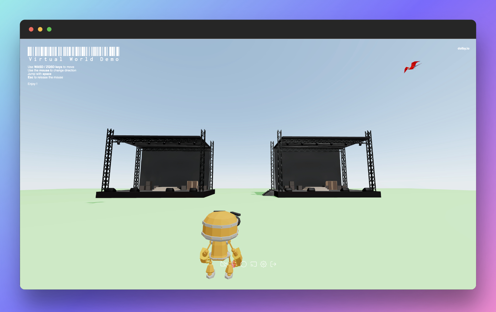

<div align="center">
    
</div>

# Dolby.io Virtual World Web Application Demo

> Discover an immersive spatial audio experience through a web application showcasing the Dolby.io Communications API's 
> capabilities on a browser.



## License

[](https://opensource.org/licenses/MIT)


## Features

* Create and join a spatial conference / event,
* Navigate in a 3d environment,
* Interact with remote participants in a 3d world,
* Use video capabilities (device selection, broadcast video, ...),
* Use audio capabilities (device selection, toggle local audio, ...),
* Share your screen,
* More to come...


## Requirements
[]() []()

* A valid [Dolby.io account](https://dolby.io/) (CPaaS - add voice and video to the application),
* A valid [PubNub account](https://www.pubnub.com/) (Real-Time communication platform - 3D locations synchronisation).

## Setup

Clone this repository to your desktop: 

```bash
git clone https://github.com/dolbyio-samples/comms-web-demo.git
```

After cloning this repository, go to its root directory and run the following command to install all the dependencies

```bash
cd comms-web-demo
npm install
```

## Environment settings

Once the dependencies are installed, create a .env file at the root of this project.
Edit it as follow: 

```bash
VITE_CLIENT_ACCESS_TOKEN=[CLIENT_ACCESS_TOKEN]      # your client access token, retrieved from Dolby.io (if you don't have a valid authentication server).
                                                    # note: this token will be valid only 12h and refresh token mechanism will not work.
#or                                                    
VITE_AUTH_URL=[AUTH_URL]                            # your own authentication server url

VITE_PUBNUB_PUBLISHER_KEY=[PUBNUB_PUBLISHER_KEY]    # PubNub publisher application key
VITE_PUBNUB_SUBSCRIBER_KEY=[PUBNUB_SUBSCRIBER_KEY]  # PubNub subscriber application key   
```

## Usage

### Debug

Once the dependencies are installed, you can run the following command to start the application in development mode: 

```bash
npm run dev
```
Then, you will able to access it at  http://127.0.0.1:5173/


### Production

If you want to build the application instead, run the following script:

```bash
npm run build
```

Once done, an application built in production mode, could be served as follows :

```bash
npm install --global serve    # if not already installed
serve ./dist
```

### Testing

To run unit tests, run one of the following commands: 

Watch mode: 
```bash
npm run test   
```

Coverage:
```bash
npm run coverage  
```

## References

* [react](https://fr.reactjs.org/) (user interfaces)
* [react three fiber](https://docs.pmnd.rs/react-three-fiber/getting-started/introduction) ( react renderer for Three.js)
* [drei](https://github.com/pmndrs/drei) (helpers for react-three-fiber)
* [react three rapier](https://github.com/pmndrs/react-three-rapier) (physics engine)
* [three.js](https://threejs.org/) (3D library)
* [redux](https://redux.js.org/) (state management)
* [redux-saga](https://redux-saga.js.org/) (side effect management)
* [Vite](https://vitejs.dev/) (frontend tooling)
* [Vitetest](https://vitest.dev/) (blazing fast unit test framework)
* [Prettier](https://prettier.io/) (code formatter)


